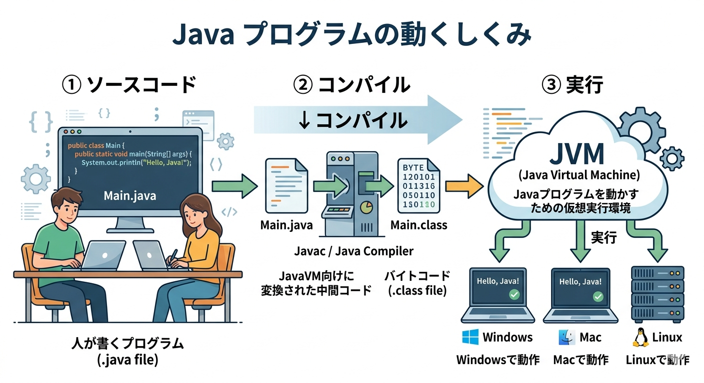
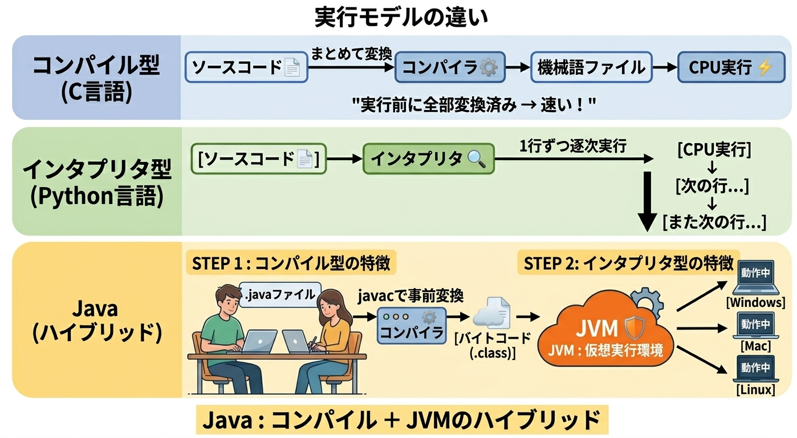

# Java言語について理解しよう
Java学習の全体像を明確にします

## 本章の目標
本章では以下を目標にして学習します。

- Javaがどんな言語か分かること
- Javaがどうやって動くのか分かること
- Javaでどんな開発ができるのか分かること

## 1. Javaとは

### 一言でいうと

Javaは、**人が読みやすい形で書いたプログラムを、JVM（Java Virtual Machine）という仮想実行環境の上で動かす言語**です。  
**大規模開発に向いており、実行環境が変わっても動かしやすい**のが大きな特徴です。

> **ポイント**  
> Javaは「JVM上で動く」ことが、移植性と保守性の土台です。

## 2. Javaでできること・向いている場面

Javaは特に、次のような開発で強みを発揮します。

- Webシステム
- 業務システム
- バックエンド開発
- 長期間運用されるシステム
- 複数人で進める大規模開発
- Android開発

理由は、**保守しやすさ・読みやすさ・仕組みの安定性**が重視されているからです。

> **ポイント**  
> Javaは、長期間運用・複数人開発のような「設計と保守」が重要な現場で力を発揮します。

## 3.Javaの動く仕組み

Javaの最大の特徴は、**OSの上で直接動くのではなく、JVMの上で動く**ことです。
だから、**どのOSの上でも動く**

### 実行の流れ

1. **Step1:** Javaでソースコードを書く
2. **Step2:** コンパイルして **バイトコード**（.class）に変換する
3. **Step3:** JVMがそのバイトコードを読み込み、各OS上で実行する

### 用語の整理

| 用語 | 意味 |
| --- | --- |
| **ソースコード** | 人が書くプログラム |
| **コンパイル** | ソースコードを実行しやすい形に変換すること |
| **バイトコード** | JVM向けに変換された中間コード |
| **JVM** | Javaプログラムを動かすための仮想実行環境 |

> **ポイント**  
> 通常、プログラムはOSやCPUが違うとそのまま動かないことがあります。  
> しかしJavaは、JVMがあることで、同じプログラムをどのOS環境でも動かすことができます。

## 4. Javaはコンパイラ型？インタープリタ型？

Javaは、よくある言語分類でいうと**両方の特徴を持つ言語**です。

| 区分 | 短い説明 | 特徴 |
| --- | --- | --- |
| **コンパイラ型** | 実行前にまとめて変換してから動かす方式 | 実行速度が速い |
| **インタープリタ型** | 読み取りながらその場で実行する方式 | すぐに試しやすい |
| **Java** | 先にバイトコードへコンパイルし、JVM上で実行する方式 | 両方の要素をあわせ持つ |

### つまり

Javaは  
Javaは **「一度コンパイルしてから、JVM上で動かす言語」** です。  
コンパイル型の速さと、インタプリタ型の手軽さ、両方の強みを持つハイブリッド言語です

> **ポイント**  
> Javaは「コンパイルしてからJVMで実行する」ため、コンパイラ型とインタープリタ型の特徴をあわせ持ちます。

## 5. 他のプログラミング言語との違い

| 言語 | 特徴 | Javaとの違い | 向いている場面 |
| --- | --- | --- | --- |
| C言語 | OS/CPUに近く、実行速度が速い | 移植性より性能重視で、環境依存が出やすい | 組み込み、OS周り、高速処理 |
| Python | 文法がシンプルで書きやすい | 型の制約が緩く、試作や小〜中規模に向きやすい | AI、データ分析、スクリプト |
| C# | .NET上で動作し、Windowsと親和性が高い | Microsoft技術との連携が強い | Windowsアプリ、ゲーム(Unity) |

## 6. Javaを選ぶ判断基準

**一言で言うと：「大きく・長く・チームで作るなら、Javaが強い」**

### Javaが選ばれる場面

<ol class="java-chosen-scenarios">
<li>

<strong>① 大規模なシステム開発</strong> 
型が厳格で設計がしやすく、大人数のチームでも品質を保ちやすい。 
銀行・保険・官公庁など企業・組織で長年使われている。

</li>
<li>

<strong>② Androidアプリ開発</strong> 
AndroidはJava（およびKotlin）で動く設計のため、モバイル開発では事実上の標準。

</li>
<li>

<strong>③ パフォーマンスが必要なサーバー処理</strong> 
JVMの最適化により実行速度が速く、高負荷なAPIやバックエンドに向いている。

</li>
<li>

<strong>④ 長期間メンテナンスが必要なシステム</strong> 
型の制約が強いため、バグが早期に発見しやすく、数年後に別の人が触っても壊れにくい。

</li>
</ol>

### 逆にJavaじゃなくていい場面

| やりたいこと | 向いている言語 |
|---|---|
| ちょっと試したい・スクリプト | Python |
| 速度を極限まで追求したい | C言語 |
| Windowsアプリ・Unityゲーム開発 | C# |

---

> **💡ポイント**  
> Javaは「コンパイルしてからJVMで実行する」ため、コンパイラ型とインタープリタ型の特徴をあわせ持ちます。  
> 速さ・安定性・移植性を兼ね備えているからこそ、大規模開発の現場で長く選ばれ続けている言語です。

## まとめ

- Javaは、**JVM上で動く言語**である  
- Javaは、**バイトコードに変換してから実行**する  
- Javaは、**保守性と大規模開発に強い**  